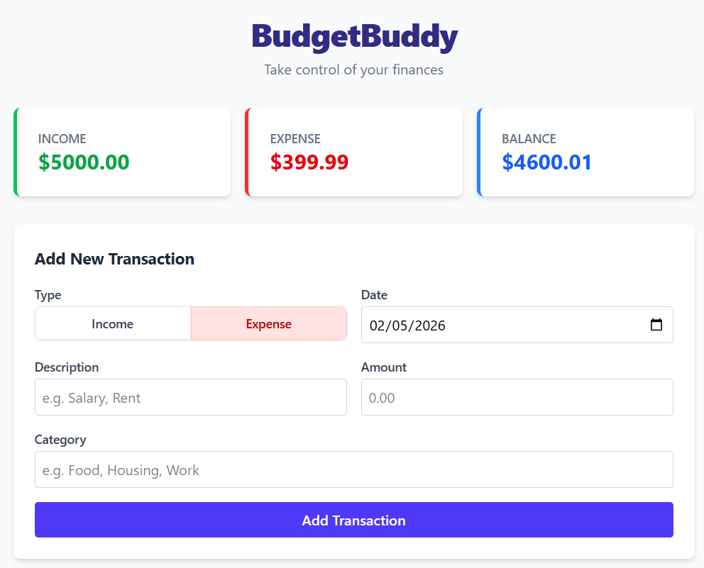

# Budget Tracker

A modern, full-stack budgeting application built with React and TypeScript. Track your transactions, monitor spending, and manage your finances with ease.

## 📸 Screenshot



## ✨ Features

- 💰 **Track Transactions** - Add, view, and manage your financial transactions
- 📊 **Budget Summary** - Get a quick overview of your spending patterns
- 🎯 **Transaction Management** - Organize and categorize your expenses
- ⚡ **Fast & Responsive** - Built with modern web technologies for optimal performance
- 🔒 **Type-Safe** - Full TypeScript support for reliable code

## 🛠️ Tech Stack

- **Frontend**
  - React 18+ with TypeScript
  - Vite for fast development and optimized builds
  - CSS modules for styling
  - ESLint for code quality

- **Backend**
  - Node.js Express server
  - RESTful API architecture

- **Development Tools**
  - Hot Module Replacement (HMR) for instant updates
  - TypeScript for type safety
  - Modern ES2020+ syntax

## 📁 Project Structure

```
project/
├── src/
│   ├── components/              # Reusable React components
│   │   ├── BudgetSummary.tsx   # Budget overview display
│   │   ├── TransactionForm.tsx # Form for adding transactions
│   │   └── TransactionItem.tsx # Individual transaction display
│   ├── interfaces/              # TypeScript type definitions
│   │   └── Transaction.ts      # Transaction data structure
│   ├── pages/                   # Page components
│   │   └── Home.tsx            # Home page
│   ├── services/                # API and external services
│   │   └── api.ts              # API client
│   ├── assets/                  # Static assets
│   ├── App.tsx                 # Root component
│   ├── main.tsx                # Application entry point
│   └── index.css               # Global styles
├── server/                      # Backend server
│   └── index.js               # Express server setup
├── index.html                  # HTML template
├── vite.config.ts              # Vite configuration
├── tsconfig.json               # TypeScript configuration
├── eslint.config.js            # ESLint configuration
└── package.json                # Project dependencies
```


## 🚀 Getting Started

### Prerequisites

- Node.js 18+
- npm or yarn

### Installation & Running

1. **Install dependencies**
   ```bash
   npm install
   ```

2. **Start the Backend Server**
   ```bash
   npm run server
   ```
   *Runs on http://localhost:5000*

3. **Start the Frontend**
   ```bash
   npm run dev
   ```
   *Runs on http://localhost:5173*


## 🔌 API Integration

The application communicates with a backend server through the `api.ts` service layer. Configure your API endpoints in the services folder to connect to your backend.

---

**Made with ❤️ using React & TypeScript**
